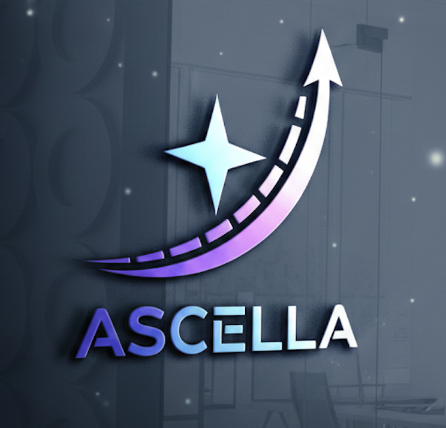
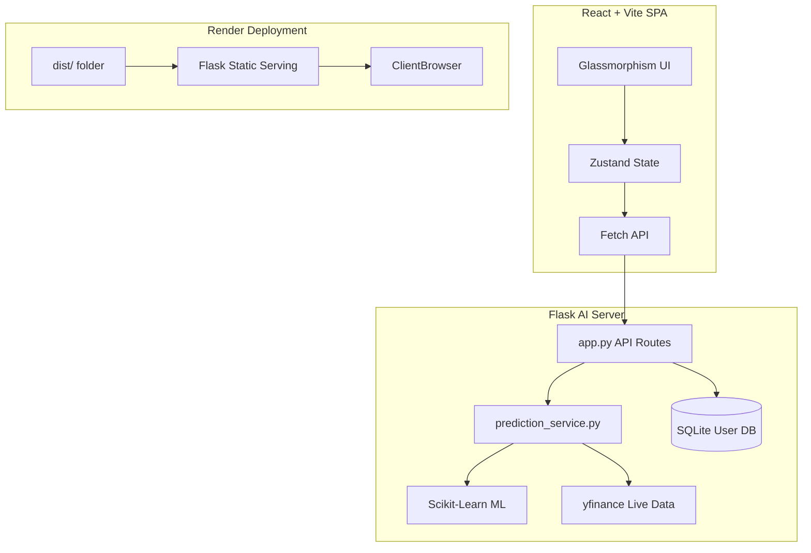

<div align="center">
  
  <h1>🚀 Ascella AI | Neural Market Intelligence</h1>
  <p><strong>A Next-Generation AI-Powered Stock Prediction & Portfolio Management Platform</strong></p>

  [](https://reactjs.org/)
  [](https://vitejs.dev/)
  [](https://tailwindcss.com/)
  [](https://flask.palletsprojects.com/)
  [](https://www.python.org/)
  [](https://scikit-learn.org/)
</div>

<br />

## ✨ Features

- 🧠 **Advanced AI Prediction Engine**: Leverages `scikit-learn` linear regression mixed with complex heuristic clamping (using volatility, moving averages) to prevent unrealistic negative prices.
- 📊 **Real-Time Sentiment Analysis**: Analyzes **RSI**, **MACD**, and **MAs** to generate accurate "Confidence Scores" and market sentiment ratings (e.g., *Strong Bullish*).
- 🌌 **Premium 3D UI/UX**: Built with Framer Motion and Tailwind CSS. Features glassmorphism panels, interactive 3D cards, and a dynamic animated trading-grid background.
- 📈 **Dynamic Charting**: Uses `recharts` to render stunning SVG gradient area charts with dashed prediction vectors.
- 💼 **Strategic Portfolio**: Track your personal holdings against the AI's target prices in real-time.

---

## 🏛️ Architecture Overview

Ascella AI utilizes a decoupled architecture in development, which is automatically compiled into a unified monolith for production deployment (e.g., Render.com).



---

## 📂 Repository Structure

```text
ascella-intelligence/
├── frontend/                 # React UI Codebase
│   ├── src/
│   │   ├── components/       # Reusable UI (Navbar, Cards, etc.)
│   │   ├── pages/            # Dashboard, Portfolio, Login Views
│   │   ├── store/            # Zustand Global State
│   │   ├── index.css         # 3D Transforms & Global Styles
│   │   └── App.tsx           # Router & Animated Backgrounds
│   ├── package.json
│   └── vite.config.ts        # Vite Bundler Settings
├── backend/                  # Python API Codebase
│   ├── app.py                # Main Flask Application & Router
│   ├── prediction_service.py # AI Engine & Technical Indicators
│   ├── market.db             # Local SQLite Database
│   └── requirements.txt      # Python Dependencies
├── render-build.sh           # Production CI/CD Build Script
└── package.json              # Root concurrent scripts
```

---

## 🚀 Local Development Setup

We have configured `concurrently` to launch both the React and Flask servers simultaneously with a single command.

### 1️⃣ Prerequisites
- Node.js (v18+)
- Python 3.9+ (with a virtual environment recommended)

### 2️⃣ Installation
Clone the repository and install root dependencies:
```bash
git clone https://github.com/TaherFakri/ascella-intelligence.git
cd ascella-intelligence
npm install
```

### 3️⃣ Boot the Platform
Run the concurrent startup script:
```bash
npm run dev
```
- **Frontend** runs at: `http://localhost:5173`
- **Backend API** runs at: `http://localhost:5050`

---

## 🌍 Production Deployment (Render.com)

Ascella AI is configured for a **unified Web Service deployment** on Render to eliminate CORS issues and reduce hosting costs.

1. Create a new **Web Service** on Render linked to this repository.
2. Set the **Build Command** to:
   ```bash
   ./render-build.sh
   ```
3. Set the **Start Command** to:
   ```bash
   cd backend && gunicorn app:app
   ```
4. Render will automatically build the Vite static files, place them in `frontend/dist`, and configure Flask to serve them directly to clients!

---

<div align="center">
  <i>"Predicting the future of markets with neural precision."</i>
</div>
