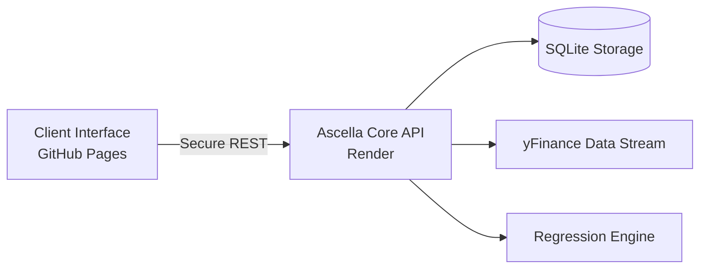
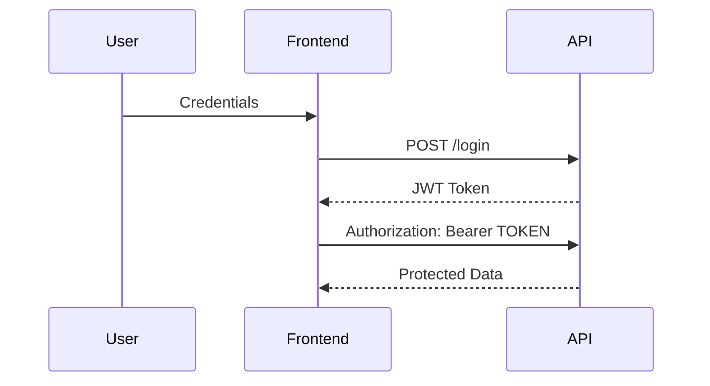
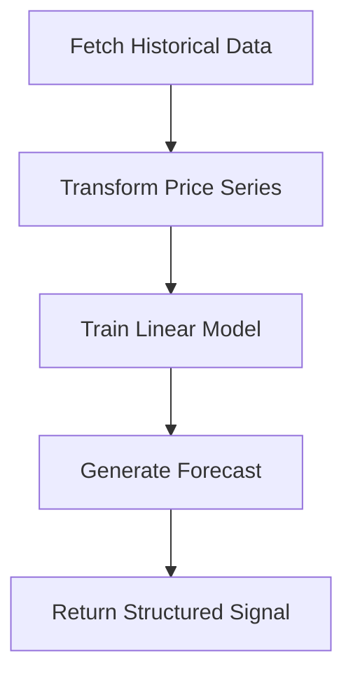

<<<<<<< Updated upstream
# 🌌 ASCELLA INTELLIGENCE

### Autonomous Market Signal Engine

<p align="center">
  
  
  
  
</p>

---

> *Precision-driven market intelligence powered by algorithmic forecasting.*

Ascella Intelligence is a full-stack AI-powered investment analysis platform engineered for:

* Real-time market evaluation
* Predictive modeling
* Portfolio performance intelligence
* Secure stateless authentication

Built for cross-domain scalability. Designed for modern web architecture.

---

# 🧠 SYSTEM ARCHITECTURE



---

# 🔐 AUTHENTICATION PROTOCOL

Ascella uses **stateless JWT authentication**.

No cookies.
No session storage.
No browser compatibility issues.



---

# 📡 LIVE SYSTEM

### 🌍 Interface

https://taherfakri.github.io/ascella-intelligence/

### ⚙ Core API

https://ascella-intelligence.onrender.com

> All protected endpoints require valid JWT authorization.

---

# 📊 MARKET SIGNAL ENGINE

Ascella performs:

1. 1-Year historical data acquisition
2. Regression model fitting
3. Short-term and long-term projection
4. AI-driven BUY / HOLD / SELL evaluation



---

# 💼 PORTFOLIO INTELLIGENCE

For each position:

* Live market valuation
* Unrealized P/L calculation
* Target price estimation
* AI exit guidance

System output:

```
SYMBOL | QUANTITY | CURRENT | TARGET | GUIDANCE
```

---

# ⚙ TECHNOLOGY STACK

**Core Engine**

* Flask
* PyJWT
* scikit-learn
* yfinance
* SQLite

**Interface**

* Vanilla JS
* Chart.js
* Intersection Observer animations

**Infrastructure**

* Render (API hosting)
* GitHub Pages (Frontend delivery)
* Gunicorn (WSGI)

---

# 🛰 DEPLOYMENT CONFIGURATION

Backend start command:

```
gunicorn app:app
```

Root directory:

```
backend
```

---

# 🧩 PROJECT STRUCTURE

```
ascella-intelligence/
│
├── backend/
│   ├── app.py
│   ├── requirements.txt
│   └── market.db
│
├── index.html
├── script.js
└── styles.css
```

---

# 🔒 SECURITY MODEL

* JWT-based stateless verification
* Header-based authorization
* Token expiration (24h)
* Cross-origin compatible architecture

Built to avoid:

* Third-party cookie issues
* Safari ITP conflicts
* Session persistence complexity

---

# 🌠 FUTURE EVOLUTION

* Deep Learning forecasting (LSTM / Transformers)
* Real-time WebSocket streaming
* Portfolio risk scoring
* Multi-user scaling (PostgreSQL migration)
* Cloud-native microservice architecture

---

# 🧑‍🚀 AUTHOR

**Taher Fakhri**
AI Systems Engineer • Full-Stack Developer

---

<p align="center">
  <em>Engineered for signal clarity. Built for autonomous precision.</em>
</p>
=======
# Ascella AI - Neural Market Intelligence

Ascella AI is a fully refactored, enterprise-grade stock prediction platform. It offers an advanced predictive engine, strategic portfolio tracking, and a sleek modern dashboard built on cutting-edge technologies.

## ✨ Features

- **Advanced Market Intelligence:** Short-term and long-term asset price predictions using heuristic constraints and ML linear regression.
- **AI Sentiment & Confidence Insights:** Technical indicators (RSI, MACD, Moving Averages) synthesized into a confidence score and market sentiment.
- **Dark Futuristic 3D UI:** Built with React, Tailwind CSS, Framer Motion, and shadcn/ui to mimic a premium SaaS trading terminal.
- **Strategic Portfolio Tracking:** Track user positions against dynamic AI benchmarks in real time.
- **Fully Localized Development:** Simple execution to run backend and frontend natively with concurrent proxies.

## 🛠️ Technology Stack

**Frontend:**
- React 18 & Vite
- Tailwind CSS (v3) + postcss
- Framer Motion (for smooth 3D/glassmorphism animations)
- Recharts (for dynamic prediction and history charts)
- Zustand (Global State Management)

**Backend:**
- Python 3 / Flask
- SQLite (Local database)
- yfinance (Live market data fetch)
- scikit-learn, numpy, pandas (Data Science / ML logic)

## 🚀 How to Run Locally

We have set up an automated concurrent script to spin up both the Vite development server and the Flask backend simultaneously.

### Prerequisites
1. Node.js (v18 or higher)
2. Python 3 (with standard virtual environment)

### Startup Sequence

1. Clone or open the repository.
2. Install root dependencies:
   ```bash
   npm install
   ```
3. Boot the application:
   ```bash
   npm run dev
   ```

> This will start the React server at `http://localhost:5173` and the Flask backend at `http://localhost:5000`.

### Individual Scripts
- `npm run client` - Starts only the React frontend.
- `npm run server` - Starts only the Python Flask backend.

## 📁 Architecture Overhaul

- **`/frontend`**: Replaces the old vanilla HTML/JS setup. Contains a full Single Page Application structure with proper `react-router-dom` routing.
- **`/backend/prediction_service.py`**: A dedicated ML service separating data processing from API routes to enhance scalability. Includes volatility dampening, clamping against unrealistic negative prices, and robust sentiment generation logic.
>>>>>>> Stashed changes
