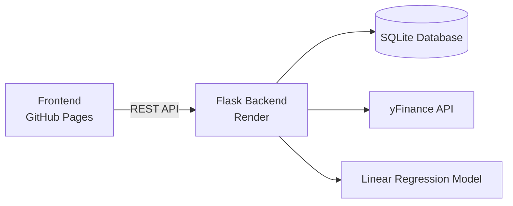
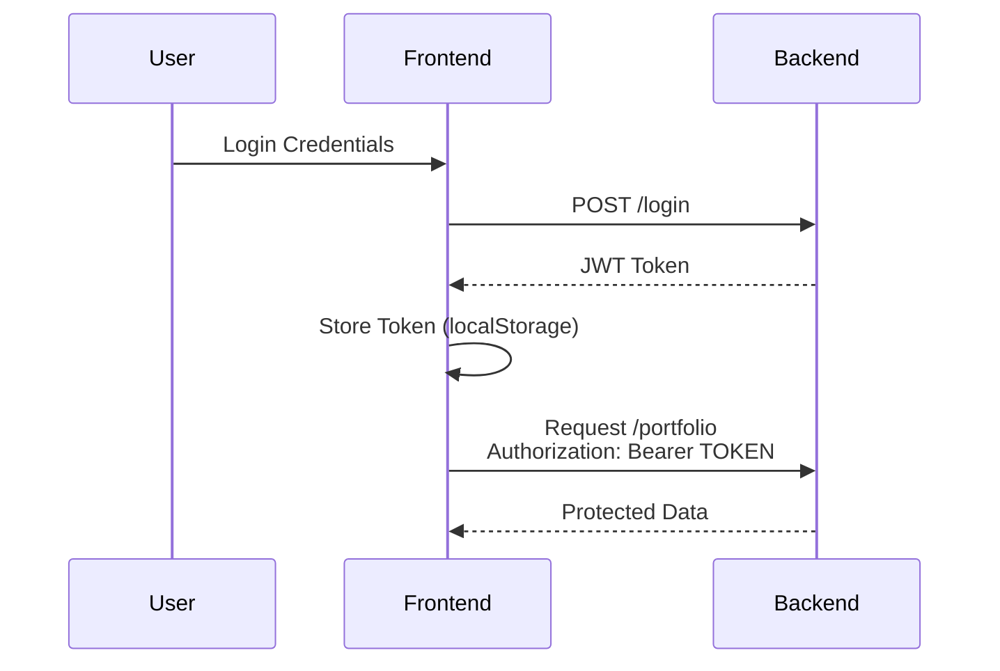
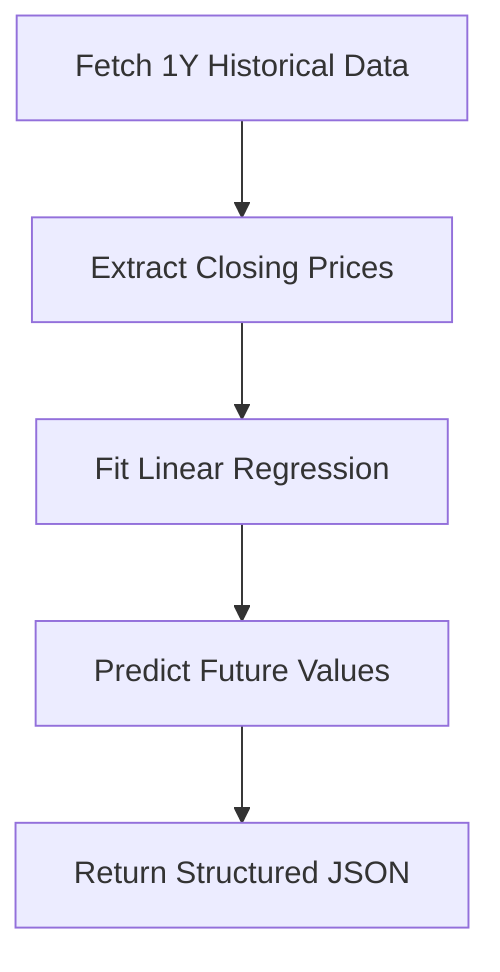

# 🚀 Ascella Intelligence

> AI-Driven Market Analysis & Portfolio Intelligence Platform
> Built with Flask • JWT • Render • GitHub Pages • Chart.js

---

<p align="center">
  
  
  
  
  
</p>

---

## 🌌 Overview

Ascella Intelligence is a full-stack AI-powered investment platform that:

* 📊 Scans market data using `yfinance`
* 🤖 Generates regression-based price forecasts
* 📈 Visualizes predictions interactively
* 💼 Tracks user portfolios
* 🔐 Secures endpoints using JWT authentication

Designed with a modern, stateless authentication architecture for cross-domain deployment compatibility.

---

# 🧠 System Architecture



---

# 🔐 Authentication Flow (JWT-Based)



### Why JWT?

* No cookies
* No SameSite issues
* Safari compatible
* Stateless backend
* Production-grade authentication

---

# 📊 AI Market Analysis Engine

Ascella uses:

* `yfinance` for historical market data
* `scikit-learn` Linear Regression
* Short-term & long-term predictive models

### Forecast Logic



---

# 💼 Portfolio Intelligence

Features:

* Add positions
* Update quantities
* Auto-calculate:

  * Total investment
  * Market value
  * Profit/Loss
* AI-driven SELL / HOLD guidance

---

# 🛠 Tech Stack

### Backend

* Flask
* PyJWT
* SQLite
* Gunicorn
* scikit-learn
* yfinance

### Frontend

* Vanilla JavaScript
* Chart.js
* CSS animations
* Intersection Observer API

### Deployment

* Render (API)
* GitHub Pages (Frontend)

---

# ⚙️ Installation (Local Development)

## 1️⃣ Clone Repository

```bash
git clone https://github.com/YOUR_USERNAME/ascella-intelligence.git
cd ascella-intelligence/backend
```

---

## 2️⃣ Create Virtual Environment

```bash
python -m venv venv
source venv/bin/activate  # Mac/Linux
venv\Scripts\activate     # Windows
```

---

## 3️⃣ Install Dependencies

```bash
pip install -r requirements.txt
```

---

## 4️⃣ Run Server

```bash
python app.py
```

Server runs on:

```
http://localhost:5050
```

---

# 🚀 Deployment

### Backend (Render)

Start command:

```
gunicorn app:app
```

Root directory:

```
backend
```

---

### Frontend (GitHub Pages)

Hosted from:

```
/docs or root branch
```

API endpoint:

```js
const API = "https://ascella-intelligence.onrender.com";
```

---

# 📁 Project Structure

```
ascella-intelligence/
│
├── backend/
│   ├── app.py
│   ├── requirements.txt
│   └── market.db
│
├── index.html
├── script.js
└── styles.css
```

---

# 🔒 Security Model

* JWT-based stateless authentication
* 24-hour token expiration
* Authorization header validation
* No third-party cookie reliance
* Cross-origin compatible

---

# 📈 Future Improvements

* Refresh token rotation
* Role-based authorization
* Redis caching layer
* PostgreSQL migration
* WebSocket live price updates
* Advanced ML forecasting (LSTM)

---

# 🌠 Live Demo

🔗 https://taherfakri.github.io/ascella-intelligence/

---

# 🧑‍💻 Author

**Taher Fakhri**
Full-Stack Developer • AI Systems Builder

---

# ⭐ If You Found This Interesting

Give the repository a star and follow for future AI-fintech builds.

---

<p align="center">
Built with precision. Engineered for scale. Designed for clarity.
</p>
